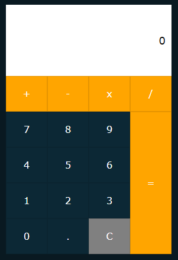

# gs3-calculadora-js

## 💻 Projeto

A calculadora foi o primeiro projeto completo desenvolvido no Programa, aplicando conceitos de HTML, CSS, DOM e JavaScript.

Para a estrutura e o layout da aplicação, utilizei o seguinte [tutorial](https://www.youtube.com/watch?v=BuZtAqk5LIY&t=13s&ab_channel=OnlineTutorials), realizando pequenas modificações para adequar ao que foi pedido no exercício. A paleta de cores busquei inspiração na calculadora do iOS.

A parte da lógica foi completamente refatorada, após o conteúdo visto em aula.

## 🚀 Tecnologias

Este projeto foi desenvolvido com as seguintes tecnologias:

- [HTML](https://github.com/topics/html)
- [CSS](https://github.com/topics/css)
- [JS](https://github.com/topics/js)

## :sparkles: Funcionalidades

- Soma
- Subtração
- Multiplicação
- Divisão
- Limpar tela

## :construction: Ideias de melhorias

- Operações com números não inteiros (ex: 2.1 + 2.1)

## :memo: Licença

Esse projeto está sob a licença MIT. Veja o arquivo [LICENSE](LICENSE.md) para mais detalhes.